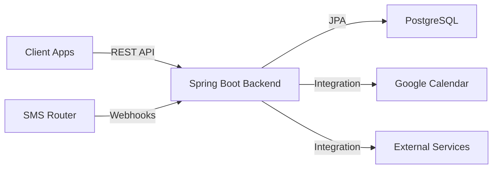

# Architecture Overview

## Project Structure

```
Effective-Office/
├── backend/           # Spring Boot backend
├── clients/           # Client applications
│   ├── shared/        # Kotlin Multiplatform shared code
│   ├── smsrouter/     # SMS Router Android app
│   ├── tablet/        # Meeting Room tablet app
│   └── tv/            # TV display app
├── iosApp/            # iOS native app
├── build-logic/       # Gradle convention plugins
├── deploy/            # Deployment configurations
├── docs/              # Documentation
└── scripts/           # Utility scripts
```

## Backend Architecture

### Module Organization
```
backend/
├── app/               # Main application module
├── core/
│   ├── data/          # Data sources and repositories
│   ├── domain/        # Business logic and use cases
│   └── repository/    # Repository implementations
└── feature/
    ├── authorization/  # Auth & JWT
    ├── booking/        # Room booking
    ├── calendar-subscription/  # Calendar integration
    ├── duolingo/       # Duolingo integration
    ├── leader-id/      # Leader ID integration
    ├── notifications/  # Notification system
    ├── photo-saver/    # Photo storage
    ├── photos/         # Photo management
    ├── sport/          # Sports stats
    ├── teammates/      # Team member management
    ├── user/           # User management
    └── workspace/      # Workspace/office management
```

### Architecture Patterns
- **Modular monolith**: Feature-based module separation
- **Clean architecture**: Domain, data, and presentation layers
- **Repository pattern**: Data access abstraction
- **Dependency injection**: Spring DI framework

## Client Architecture

### Tablet & TV Apps
```
app/
├── composeApp/        # Main Compose application
├── core/
│   ├── data/          # Data layer
│   ├── domain/        # Business logic
│   └── ui/            # UI components and theme
└── feature/
    ├── [feature-name]/ # Feature-specific UI & logic
    └── ...
```

### Shared Module
- Common data models
- Network clients
- Business logic shared across platforms

## Key Integration Points

### Google Calendar
- Integration documented in `docs/CALENDAR_INTEGRATION.md`
- Bidirectional sync for meeting room bookings

### External Services
- Duolingo API
- Sports tracking systems
- Internal currency/reward systems
- Leader ID authentication

## Data Flow


